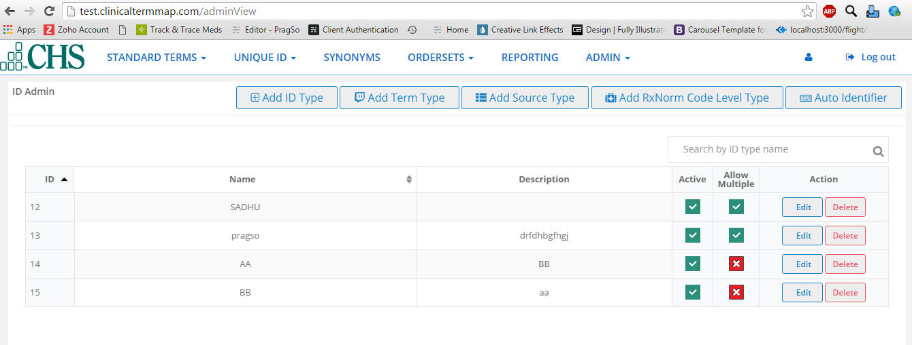
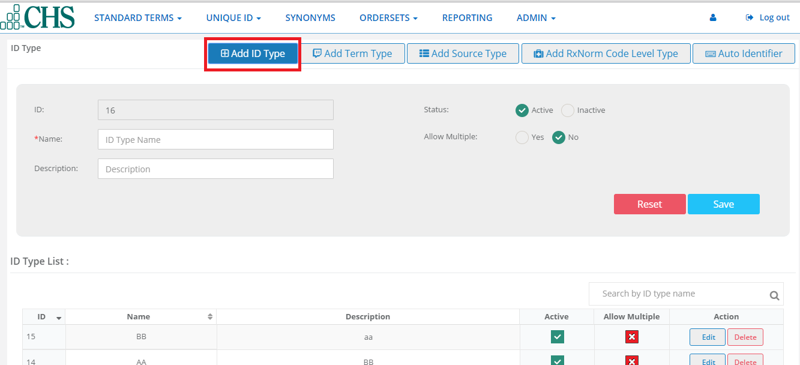
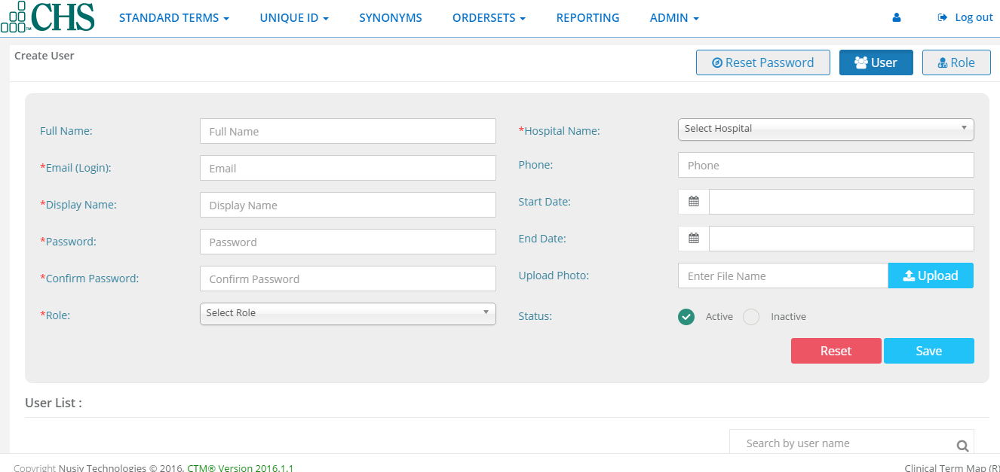
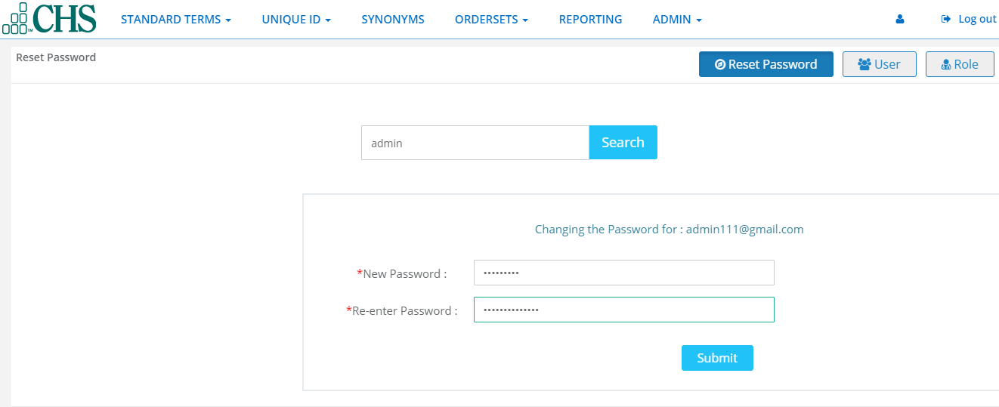

Admin
=====
The Admin feature lets you setup each hospital/facility,EHR type and identifiers using these categories:

The Admin screen displays ID,Name,Description,whether Active/Inactive and Allow Multiple.You can search for a specific hospital,and sort by ID and/or by name in ascending/descending order.

ID Admin
^^^^^^^^

Add ID Type
...........
**Add ID Type** is used for assigning value to each of the hospital(facilities) and EHRs.

1.Click on Add Id Type button.

2.You will see the ID Type customization Screen.

3.The Id is a automatically numbered for the next ID type. Type a Name,and then a Description.Click to checkmark a status of either Active or Inactive,and whether or not to Allow Multiples.

.. image:: adminidadmin2.png
   :width: 500px
   :align: center
   :height: 200px
    

4.Click  Save.The new hospital will now appear in the ID Type List. 

5.Each ID can be changed or removed by using EDIT or DELETE. Click the EDIT button.

6.If you decide Not to change the ID,Click Close.If you want to save Changes,click UPDATE.

Add Term Type
.............
Term type is used by ClinicalTermMap Admins to make sure National library of Medicine terminology is up to date on a monthly basis.

**Note**: Throughout the year US Library updates. ClinicalTermMap by NUSIV will update the RXCUI lookup table data in the cloud, if there are any mismatches, it will be updated.CHS or other client, they have an EHR they have to update the data in ,each hospital logs sends their databases as an import and then we give back to the same file. We don't want to chane the format they send us - if ther is a duplicate, there will not be a problem.

Add Source Type
...............
Source type shows a list of medication providers. This list comes from the National Library of Medicine.

Add RXNorm Code Level Type
..........................

Auto Identifier
...............

.. image:: autoidentifier.png
   :width: 500px
   :align: center
   :height: 200px

Users
^^^^^
User allows the admin to give ROLE to users,Created Users,active,inactive,edit and delete users,and reset password

Role
....

Roles give users access privileges within the system.

1.Click Role and type role name.

2.Click to checkmark-select permissions for the new role.

3.Click save. The new role will appear in the list where you can also EDIT or DELETE.

User
....

1.Click User button and enter Full Name, Email, Display name, Password, Role and Other information.

2.You can upload user's logo by clicking the upload button, browsing for the picture file and clicking the upload button.

3.Click save. The new user will appear in the User List where you can also Edit, Delete, Activate, or Inactivate.

Reset Password
..............

Reset Password allows an adminito search for a user and reset their password.

1.Click Reset Password. Type a user's name in the search field.

.. image:: usersreset.png
   :width: 500px
   :align: center
   :height: 200px

2.Click the search button, type and re-enter a new password and click submit

Facilities
^^^^^^^^^^
Facilities allows the admin to add and manage Hubs, Companies(Corporate Healthcare Entities), Hospitals(Facilities) and EHRs(Electronic Health Record applications). You can delete, activate and inactivate companies, hospitals and EHRs.

.. image:: adminfacilities.png
   :width: 500px
   :align: center
   :height: 200px

Hub
...
.. image:: facilitieshub.png
   :width: 500px
   :align: center
   :height: 200px

Company
.......
1.Click on company.

2.Type company information.

3.Add the company's logo by clicking the upload button, browsing for the picture file and click the upload button.

4.Check a status of Active or Inactive and click save.The new company will appear in the companies list where you can also Edit, Delete, Active or Inactive.

.. image:: facilitiescompany.png
   :width: 500px
   :align: center
   :height: 200px

Hospital
........
1.Click on Hospital button.

2.Type in hospital information.

3.You can add the company's logo by clicking the upload button, browsing for the picture file and click upload button.

4.Check a status of Active or Inactive and click Save.The new hospital will appear in the facilities list where you can also EDIT, DELETE, Active, or Inactive

.. image:: facilitieshospital.png
   :width: 500px
   :align: center
   :height: 200px

EHRs
....
1.Click on EHRs button.

2.Type in EHR information.

3.Check a status of Active or Inactive and click save.The new EHR will appear in the EHRs list where you can also Edit, DElete,Active,or Inactive.

.. image:: facilitiesehr.png
   :width: 500px
   :align: center
   :height: 200px

